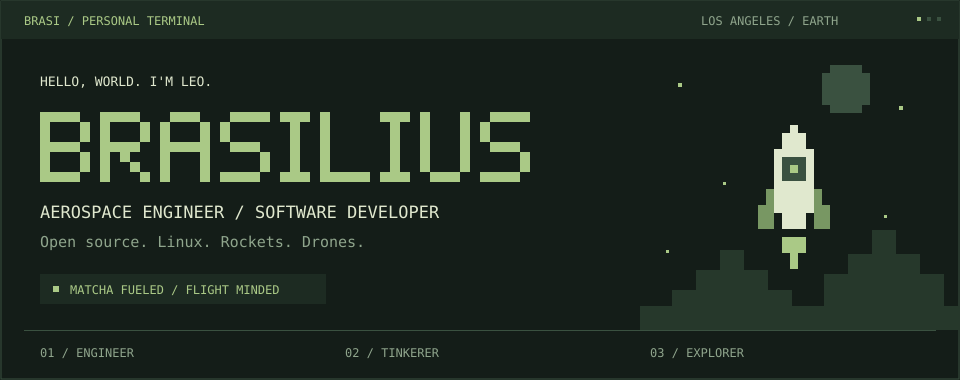

<p align="center">
  
</p>


<p align="center">
  <a href="https://nielslarsen.dev"></a>
</p>


<p align="center">
  <a href="https://nielslarsen.dev"></a>
  <a href="https://github.com/Brasilius?tab=repositories"></a>
  <br />
  <a href="https://github.com/Brasilius?tab=overview"></a>
  <a href="https://monkeytype.com/profile/Brasi"></a>
</p>

### The flight deck

I'm **Leo**, an aerospace engineer based in the **Los Angeles Metroplex**. I work on effector systems integration and test at **CHAOS Industries**, and spend my time exploring open source technologies, Linux, and wireless telemetry systems. Always interested in **rockets and drones**.

```text
operator    leo / brasilius
mission     effector systems integration & test
machine     Framework 13
system      Fedora Linux
fuel        matcha + the occasional jet fuel
```

### Toolbox

| Workbench | Tools |
| :--- | :--- |
| Systems & simulation | C · C++ · Rust · Python · Java · MATLAB |
| Web & interfaces | JavaScript · TypeScript · Svelte · HTML · CSS |
| Daily essentials | Linux · Bash · Git · GitHub · Docker · VS Code |

### Contribution garden

A little pixel snake tending a year of public contributions. Fresh growth every day.

<p align="center">
  <a href="https://github.com/Brasilius?tab=overview"></a>
  <br />
</p>

<details>
<summary><strong>Telemetry / GitHub stats</strong></summary>
<br />

<p align="center">
  <a href="https://github.com/Brasilius?tab=repositories">
    
  </a>
  <a href="https://github.com/Brasilius?tab=repositories">
    
  </a>
</p>

<sub>Cards are supplied by GitHub Readme Stats; repository language totals reflect code volume.</sub>

</details>

<br />

<p align="center">
  <a href="https://nielslarsen.dev"></a>
  <br />
  <sub>Original matcha artwork · <a href="https://nielslarsen.dev">nielslarsen.dev</a></sub>
</p>
